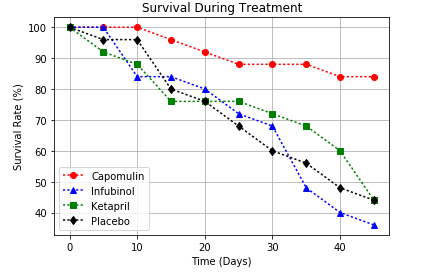
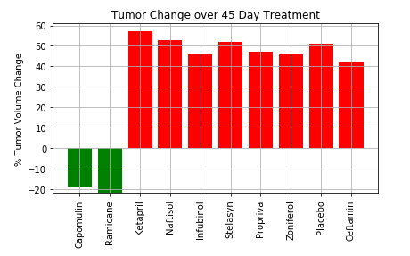
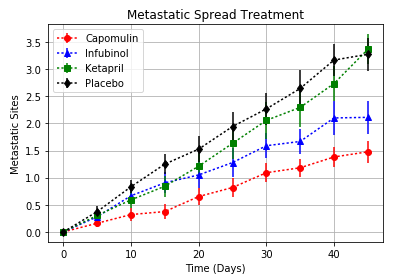

Pymaceuticals Inc - a data analytics study on efficacy 

Pymaceuticals specializes in drug-based, anti-cancer pharmaceuticals. In their most recent efforts, they've since begun screening for potential treatments to squamous cell carcinoma (SCC), a commonly occurring form of skin cancer.

In this study, 250 mice were treated through a variety of drug regimes over the course of 45 days. Their physiological responses were then monitored over the course of that time. The objective is to analyze the data to show how four treatments (Capomulin, Infubinol, Ketapril, and Placebo) compare. Datasets were provided in CSV format, and the analysis was performed with the Pandas and Matplotlib libraries in Python. The Jupyter Notebook and corresponding data are enclosed within the repository.

An efficacy study of 10 different cancer treatment drugs was carried out on a large group of mice. Specifically, 25 mice with known cancerous tumors were assigned to each of the drugs and subsequently monitored over a 45-day period.

First, the baseline survival rate was characterized in 5 day increments. The cohorts all began with 25 mice with rapid differences in survival evident within 10 days of the treatment cycles. Through the experiment, Capomulin showed approximately an 85% survival through the course of treatment, compared to other drugs which produced only a 35-45% survival rate. 

 

The tumor size on each surviving mouse was characterized every 5 days. Again a large difference in response was seen between several of the drugs. Capomulin and Ramicane showed a distinct reduction in tumor size during the 45-day course of treatment, whereas the other 8 drugs showed a significant increase in tumor size of up to 50%. This result correlates well with the survival rates (Ramicane also showed 20 of 25 mice surviving the 45-day treatment cycle).

Finally, when looking at the metastatic spread of tumors through the treatment cycle, again, Capomulin showed the best prevention of metastasis where some drugs, notably Ketapril showed significant metastatic spread of the tumors. The error bars also indicate that Capomulin’s results are more repeatable across the cohorts.
 
 

In summary, the data quite clearly shows that Capomulin exhibits low metastatic spread and significant tumor size reduction through the course of treatment. Consequently, Capomulin exhibits the best survival rate for mice during the 45-day treatment. Conversely, Ketapril exhibited the worst performance in all areas. 
